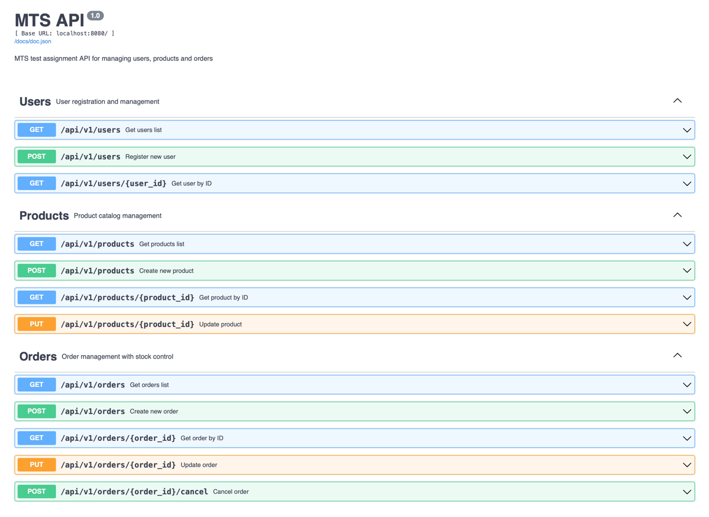

# MTS Тестовое Задание

Тестовое задание для MTS - сервис управления пользователями, продуктами и заказами с реляционной базой данных PostgreSQL.




## Архитектура

Проект реализован в стиле слойной архитектуры с DDD (Domain Driven Design) подходом:


### Слои архитектуры:

- **Domain Layer** (`internal/domain`) — доменные модели и бизнес-правила
- **Application Layer** (`internal/application`) — use cases и оркестрация бизнес-логики  
- **Repository Layer** (`internal/repository`) — слой доступа к данным с DTO паттерном
- **Transport Layer** (`internal/transport`) — REST API транспорт
- **Config** (`internal/config`) — конфигурация приложения
- **Bootstrap** (`internal/bootstrap`) — инициализация приложения

### Основные сущности:

#### User
- **id** - UUID, primary key
- **firstname**, **lastname** - имя и фамилия
- **fullname** - вычисляемое поле (firstname + lastname)
- **age** - возраст (ограничение: >= 18 лет)
- **is_married** - семейное положение
- **password_hash**, **salt** - хеш пароля и соль (пароль >= 8 символов)

#### Product  
- **id** - UUID, primary key
- **description** - описание продукта
- **tags** - теги для категоризации (JSON массив)
- **quantity** - количество на складе

#### Order
- **id** - UUID, primary key
- **user_id** - связь с пользователем
- **status** - статус заказа (pending, confirmed, cancelled, completed)
- **items** - элементы заказа с историчностью

#### OrderItem (историчность)
- **id** - UUID, primary key
- **order_id** - связь с заказом
- **product_id** - связь с продуктом
- **quantity** - количество
- **product_snapshot** - снимок продукта на момент заказа (JSON)

## Функциональность

### ✅ Реализованные требования:

1. **Регистрация пользователя** - только пользователи >= 18 лет
2. **Валидация пароля** - минимум 8 символов с солью и хешированием
3. **Заказ продуктов** - пользователь может заказать продукт
4. **Множественные заказы** - у пользователя может быть много заказов
5. **Множественные продукты в заказе** - заказ может содержать множество продуктов
6. **Контроль остатков** - если продуктов нет на складе, его нельзя заказать
7. **Историчность** - сохраняется снимок продукта на момент заказа (старая цена/описание)

### 🔧 Технические особенности:

- **REST API** с Swagger документацией
- **Слойная архитектура** с четким разделением ответственности
- **Логирование** с использованием zerolog из shared модуля
- **Поток данных** как в чистой архитектуре (зависимости направлены внутрь)
- **Валидация** на уровне доменных моделей
- **Кэширование** на уровне repository
- **Транзакции** для атомарности операций с заказами
- **DTO паттерн** для маппинга между слоями

## Стек технологий

- **GoLang 1.24**
- **Fiber v3** - REST API фреймворк
- **PostgreSQL** - основная база данных
- **Squirrel** - SQL query builder
- **TTL Cache** - кэширование
- **Swagger/OpenAPI** - документация API
- **Goose** - миграции БД
- **Zerolog** - структурированное логирование

## Запуск

### 1. Установка зависимостей
```bash
cd mts
go mod tidy
```

### 2. Настройка PostgreSQL
Запустите PostgreSQL и создайте базу данных:
```sql
CREATE DATABASE mts;
CREATE USER mts WITH PASSWORD 'mts_password_2024';
GRANT ALL PRIVILEGES ON DATABASE mts TO mts;
```

### 3. Применение миграций
```bash
# Запуск с применением миграций происходит автоматически при старте
go run cmd/main.go
```

### 4. Доступ к API
- **API**: http://localhost:8080/api/v1
- **Swagger документация**: http://localhost:8080/docs

## API Endpoints

### Users
- `POST /api/v1/users` - регистрация пользователя
- `GET /api/v1/users` - список пользователей (с пагинацией)
- `GET /api/v1/users/:id` - получить пользователя по ID

### Products
- `POST /api/v1/products` - создать продукт
- `GET /api/v1/products` - список продуктов (с фильтрацией и пагинацией)
- `GET /api/v1/products/:id` - получить продукт по ID
- `PUT /api/v1/products/:id` - обновить продукт

### Orders  
- `POST /api/v1/orders` - создать заказ (с проверкой остатков)
- `GET /api/v1/orders` - список заказов (с фильтрацией)
- `GET /api/v1/orders/:id` - получить заказ по ID
- `PUT /api/v1/orders/:id` - обновить статус заказа
- `POST /api/v1/orders/:id/cancel` - отменить заказ (восстановление остатков)

## Тесты

Покрыты тестами ключевые функции:

1. **Регистрация пользователя** - валидация возраста и пароля
2. **Создание заказа** - проверка остатков на складе
3. **Отмена заказа** - восстановление количества продуктов

Запуск тестов:
```bash
go test ./...
```

## Обоснование выбора REST API

Выбран **REST API** вместо gRPC по следующим причинам:

1. **Простота интеграции** - REST API легче интегрировать с различными клиентами
2. **Swagger документация** - автоматическая генерация документации  
3. **Отладка** - простая отладка через браузер и curl
4. **Кэширование** - возможность использования HTTP кэширования
5. **Соответствие задаче** - для CRUD операций REST более естественен

## Обоснование слойной архитектуры

Выбрана **слойная архитектура** с элементами чистой архитектуры:

1. **Разделение ответственности** - каждый слой решает свои задачи
2. **Тестируемость** - легко мокать зависимости между слоями
3. **Переиспользование** - shared модуль переиспользуется из основного проекта
4. **Масштабируемость** - легко добавлять новую функциональность
5. **Соответствие команде** - архитектура в стиле существующего кода

## Структура проекта

```
mts/
├── cmd/main.go                    # Точка входа
├── internal/
│   ├── domain/                    # Доменные модели
│   │   ├── user.go               # User entity + interfaces
│   │   ├── product.go            # Product entity + interfaces  
│   │   ├── order.go              # Order entity + interfaces
│   │   ├── error.go              # Доменные ошибки
│   │   └── test_factory.go       # Factory для тестов
│   ├── application/               # Use cases
│   │   ├── user.go               # Регистрация пользователей
│   │   ├── product.go            # Управление продуктами
│   │   └── order.go              # Создание заказов с проверкой остатков
│   ├── repository/storage/        # Data access layer
│   │   ├── user.go, user_dto.go  # User storage + DTO
│   │   ├── product.go, product_dto.go # Product storage + DTO
│   │   └── order.go, order_dto.go # Order storage + DTO
│   ├── transport/rest/            # REST API
│   │   ├── app.go                # Fiber app setup
│   │   ├── user.go               # User handlers
│   │   ├── *_model.go            # API models
│   │   └── pagination_model.go   # Общие модели
│   ├── config/service.go          # Service configuration
│   └── bootstrap/application.go   # App initialization
├── migration/postgres/            # Database migrations
├── config.yaml                   # Configuration file
├── go.mod                        # Go modules
└── README.md                     # This file
``` 
